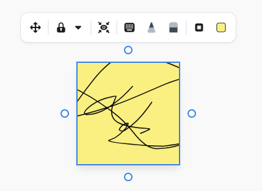
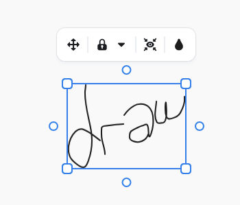
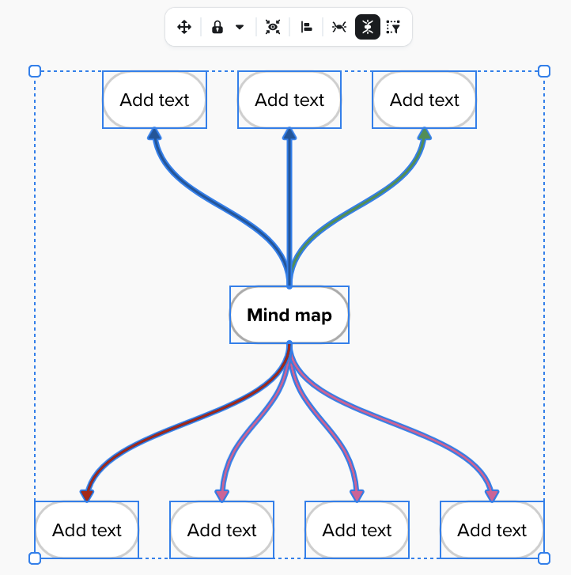
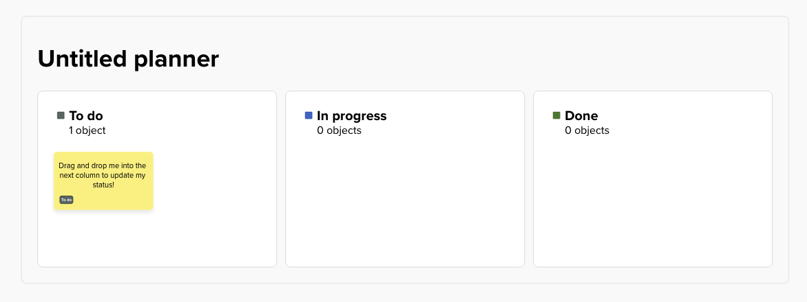

# Mural Ruby

Ruby library for the [Mural](https://app.mural.co) public API.

## Installation

```sh
git checkout https://github.com/mickaelpham/mural-ruby
cd mural-ruby
bundle install
```

## Authorization

1. [Register a new app][register-app] and gather your `client_id` and
   `client_secret`. For the scopes, pick the minimum required for your
   application.

2. Create a `.env` file with the following template and fill in
   `MURAL_CLIENT_ID` and `MURAL_CLIENT_SECRET` with those values:

```
MURAL_CLIENT_ID=
MURAL_CLIENT_SECRET=
MURAL_SCOPE=
MURAL_REDIRECT_URI=http://localhost:4567/callback
MURAL_HOST=app.mural.co
```

3. Run the script to request your access and refresh tokens:

```sh
bin/authorize
```

4. Start the console:

```sh
bin/console
```

5. From the console, create a client instance and start using it, e.g.:

```sh
irb(main):001> mural = Mural::Client.from_env
=>
#<Mural::Client:0x0000000120baa740
...
irb(main):002> mural.users.current_user
=>
#<Mural::CurrentUser:0x0000000124614bd8
 @avatar="<AVATAR_URL>",
 @company_id=nil,
 @company_name=nil,
 @created_on=1753301275000,
 @email="<USER_EMAIL>",
 @first_name="<USER_FIRST_NAME>",
 @id="=<USER_ID>",
 @last_active_workspace="<USER_WORKSPACE>",
 @last_name="<USER_LAST_NAME>",
 @type="member">
```

## Usage

### Upload a file to a mural

To upload a `my.pdf` file that's located in the same directory as where you
are running the script:

```rb
MURAL_ID = 'workspace-1.mural-1'

client = Mural::Client.from_env

# Create an asset, receive an URL to upload the content to.
asset = client.mural_content.create_asset(
  MURAL_ID,
  file_extension: 'pdf',
  asset_type: 'file'
)

# Upload the asset to the received URL.
request = Net::HTTP::Put.new(uri)
request['x-ms-blob-type'] = asset.headers.blob_type

path = File.expand_path('./my.pdf', __dir__)
request.body = File.read(path)

Net::HTTP.start(
  uri.hostname, uri.port, use_ssl: uri.scheme == 'https'
) do |http|
  http.request request
end

# Create a `file` widget on the mural to display the asset preview.
params = Mural::Widget::CreateFileParams.new.tap do |params|
  params.name = asset.name
  params.x = 250
  params.y = 0
end

client.mural_content.create_file(MURAL_ID, params)
```

## Known limitations

- `DrawWidget`, AKA sketches, are not returned by the `GET widgets` endpoint.



- Similarly, `InkingWidget`, AKA drawings, are not returned by the endpoint.



- Mind maps are smart widgets, they are simply a collection of text and arrow
  widgets. There are no specific `type` for a mind map in the API.



- Likewise, smart planners are collection of widgets, and the API doesn't
  specify anything about them.



[register-app]: https://developers.mural.co/public/docs/register-your-app
